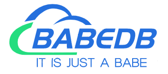
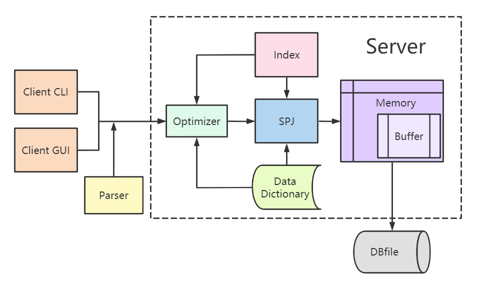
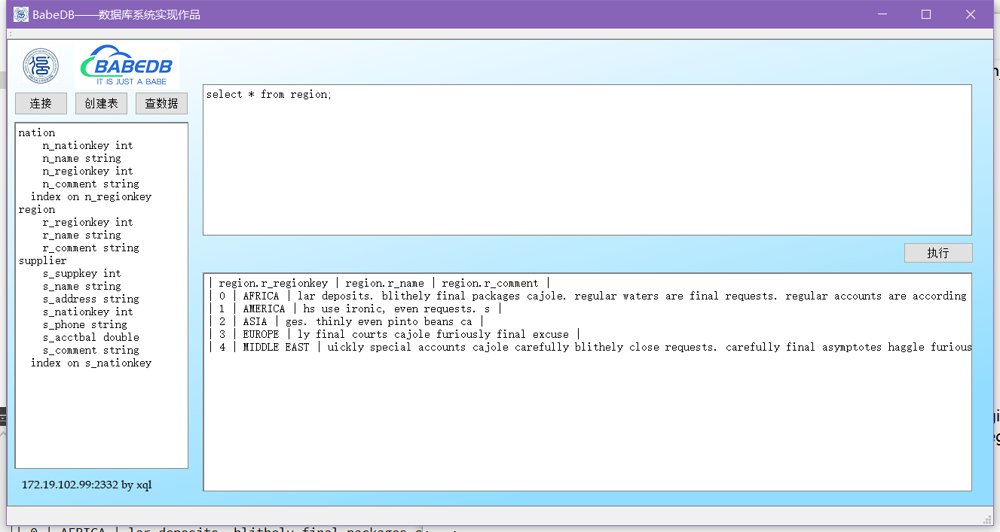

# 小型DBMS设计——BabeDB

> *It is just a Babe!*

本项目是信院DBMS实现课程期末作业，小组成员有薛钦亮、刘佳伟、黄伟琛、郭云达，本次作业分工明确，层次分明，与用户交互较为友好。

## 系统架构

## 界面展示

How to compile and run:

- make
- make install
- cd main/
- make
- ./sqlserver + port
- ./sqlclient + ip(or localhost) + port
    - port must be the same as server
    - login as a user and password, you can add in main/user.txt
- ./gui is a middle program, to transform information between server and GUI, GUI is written by QT Creator, a QT C++ program, you can run it in Windows or any system.

Need to do:

- see src/util/sqltrans.cpp, if want to optimize sql, you need to change the order of tables and conditions
- src/util/desc.md is a description for StatementInfo

Parser Documentation
====================

Internal Links:

* [Developer Documentation](dev-docs.md)
* [Supported SQL Queries](syntax-support.md)
* [Known Limitations & Missing Features](known-limitations.md)
* [Basic Usage](basic-usage.md)

External Resources:

* [Original Dev-Paper (2015)](http://torpedro.com/paper/HyriseSQL-03-2015.pdf)
